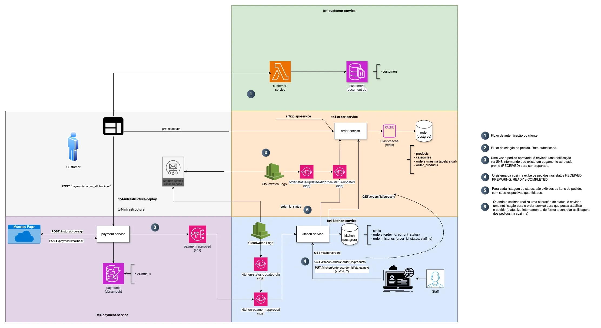

<a name="readme-top"></a>

# <p align="center"><b>Fast Food</b> <small>FIAP Tech Challenge 4 - Infrastructure Terraform</small></p>

<p align="center">
    
</p>

<p align="center">
    
</p>

## 💬 About

Repository for the [FIAP](https://postech.fiap.com.br/) Tech Challenge 4, focused on deploying infrastructure using Terraform and Kubernetes.

## 🔗 Related Projects

This project is part of a larger system that includes:

- [Customer Service](https://github.com/FIAP-SOAT-G20/tc4-customer-service)
- [Order Service](https://github.com/FIAP-SOAT-G20/tc4-order-service)
- [Payment Service](https://github.com/FIAP-SOAT-G20/tc4-payment-service)
- [Kitchen Service](https://github.com/FIAP-SOAT-G20/tc4-kitchen-service)
- [Infrastructure - Deploy (k8s)](https://github.com/FIAP-SOAT-G20/tc4-infrastructure-deploy)

## 🏗️ Architecture



### :open_file_folder: Project Structure

```sh
.
├── docs
└── modules
    ├── api_gateway
    ├── ecr
    ├── eks_instance
    ├── lambda
    ├── mongodb_atlas
    ├── rds_instance
    ├── sns_instance
    └── sqs_instance
```

<p align="right">(<a href="#readme-top">back to top</a>)</p>


## :computer: Technologies

- [Terraform](https://www.terraform.io/downloads.html)
- [AWS](https://aws.amazon.com/)
- [Kubernetes](https://kubernetes.io/)

## :scroll: Requirements

- [Terraform](https://www.terraform.io/downloads.html)

<p align="right">(<a href="#readme-top">back to top</a>)</p>

## :cd: Installation

```sh
git clone https://github.com/FIAP-SOAT-G20/tc4-infrastructure-tf
```

```sh
cd tc4-infrastructure-tf
```

<p align="right">(<a href="#readme-top">back to top</a>)</p>

## :runner: Running

```sh
make aws-eks-auth
```

```sh
make tf-init
```

```sh
make tf-plan
```

```sh
make tf-apply
```

```sh
make tf-destroy
```

<p align="right">(<a href="#readme-top">back to top</a>)</p>

## :clap: Acknowledgments

- [FIAP](https://postech.fiap.com.br/) for the opportunity to participate in this challenge.
- [Terraform](https://www.terraform.io/) for providing the tools to manage infrastructure as code.
- [AWS](https://aws.amazon.com/) for the cloud services used in this project.
- [Kubernetes](https://kubernetes.io/) for container orchestration.

<p align="right">(<a href="#readme-top">back to top</a>)</p>

## :busts_in_silhouette: Contributors

<div align="center">
  <table>
    <tbody>
      <tr>
        <td align="center" valign="top" width="14.28%"><a href="https://github.com/atomaz"><br /><sub><b>Alice Tomaz</b></sub></a><br />
        <td align="center" valign="top" width="14.28%"><a href="https://github.com/filipe1309"><br /><sub><b>Filipe Bonfim</b></sub></a><br />
        <td align="center" valign="top" width="14.28%"><a href="https://github.com/hugokishi"><br /><sub><b>Hugo Kishi</b></sub></a><br />
        <td align="center" valign="top" width="14.28%"><a href="https://github.com/marcos-nsantos"><br /><sub><b>Marcos Santos</b></sub></a><br />
        <td align="center" valign="top" width="14.28%"><a href="https://github.com/th3r4ven"><br /><sub><b>Matheus</b></sub></a><br />
      </tr>
    </tbody>
  </table>
</div>

<p align="right">(<a href="#readme-top">back to top</a>)</p>
